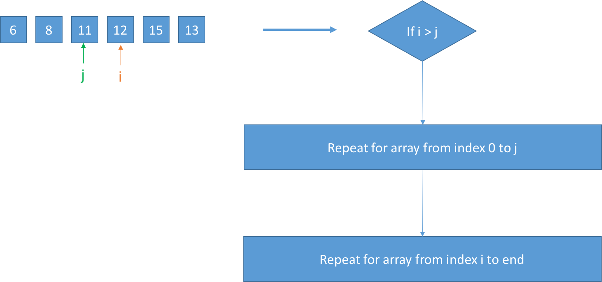
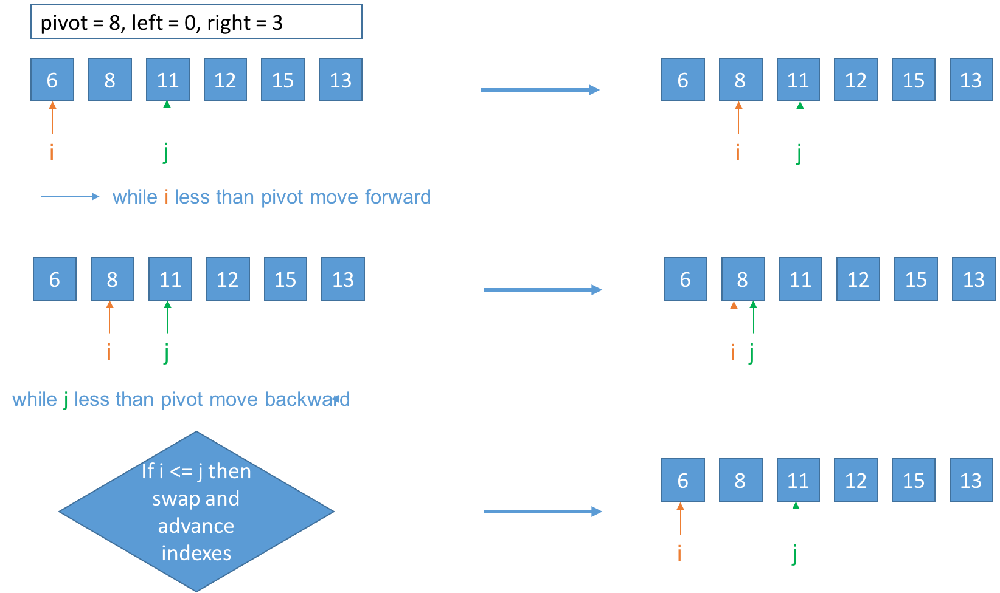
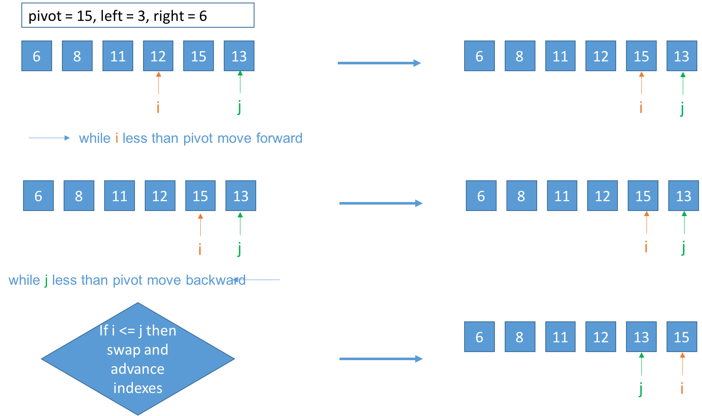

#### [<- Go Back](../) ####

# Quick sort 
> Divide and conquer strategy

- Average time complexity: O(n log n)
- Worst case time complexity: O(n^2)
- Memory complexity: In place
- Not stable
- Recursive algorithm

## Algorithm

1. **Choose a pivot value.** We take the value of any element as pivot value.
2. **Partition.** Rearrange elements in such a way, that all elements which are lesser than the pivot 
go to the left part of the array and all elements greater than the pivot, go to the right part of the 
array. Values equal to the pivot can stay in any part of the array. 
Notice, that array may be divided in non-equal parts.
3. **Sort both parts.** Apply quicksort algorithm recursively to the left and the right parts.

For instance,

 - Input: [6, 8, 12, 11, 15, 13]
 - Output: [6, 8, 11, 12, 13, 15]

## Solution

## Pivot election
The election of the pivot value is not trivial, this could be the difference between an O(n log n) 
performance and the worst case O(n^2).

Some recommendations are:
* Middle value
* Random
* Median-of-three

## References

 - https://en.wikipedia.org/wiki/Quicksort
 - http://www.algolist.net/Algorithms/Sorting/Quicksort
 - http://stackoverflow.com/questions/164163/quicksort-choosing-the-pivot
 